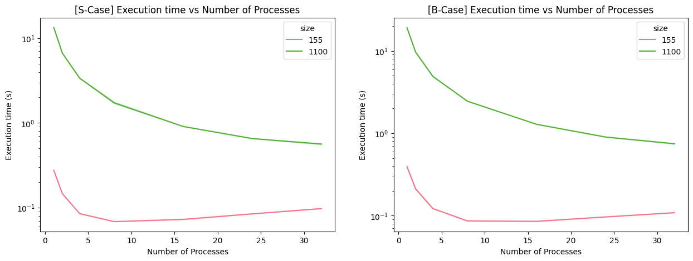
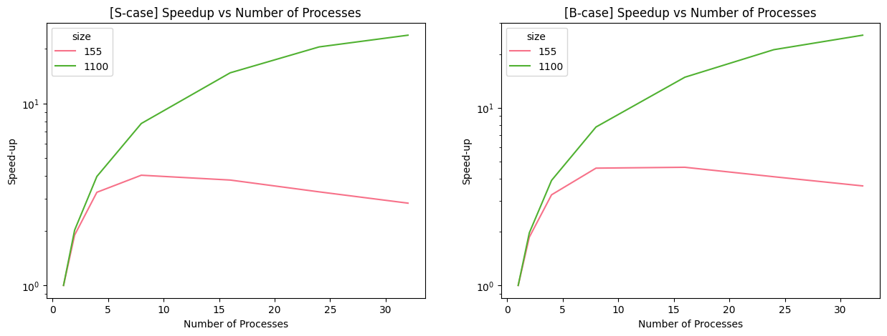
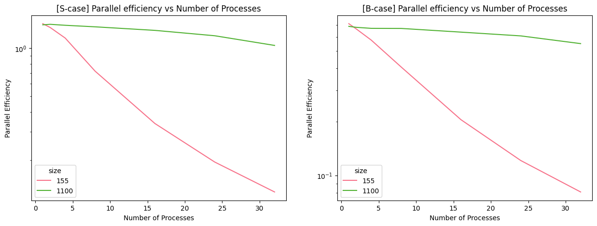
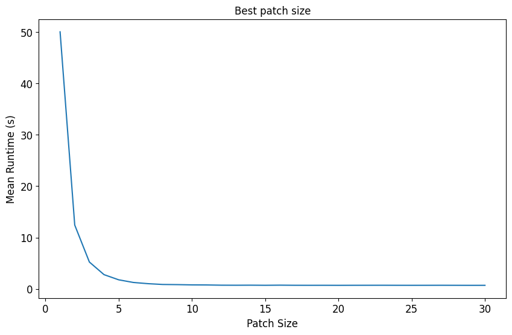
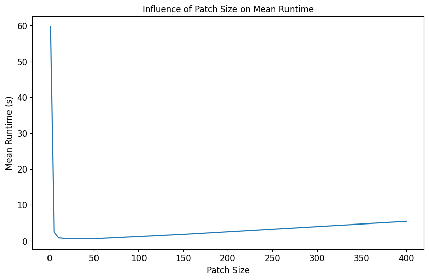

simple and parallel implementation of the julia set in python.

# benchmarking

we used two different seeds we refer to as the "special seed" and the "benchmark seed" to evaluate the performance of our implementation.

_speedup_

-   what difference does parallelization make?
-   $\begin{aligned}S_a(n,p) = \frac{T_{\text{seq}}(n)}{T_{\text{par}}(n,p)}\end{aligned}$ = absolute speedup
-   $\begin{aligned}S_r(n,p) = \frac{T_{\text{par}}(n, 1)}{T_{\text{par}}(n,p)}\end{aligned}$ = relative speedup
-   where:
    -   $n$ = input size
    -   $p$ = number of processors
    -   $T_{\text{par}}(n,p)$ = parallel runtime
    -   $T_{\text{seq}}(n)$ = sequential runtime

_efficiency of parallelization_

-   what difference does each processor make?
-   $\begin{aligned}E(n,p) = \frac{T_{\text{seq}}(n)}{p \cdot T_{\text{par}}(n,p)} = \frac{1}{p} \cdot S_a(n,p)\end{aligned}$

_special seed_

| size | p   | mean runtime (s) | speed-up | par. eff. |
| ---- | --- | ---------------- | -------- | --------- |
| 155  | 1   | 0.276419         | 1        | 1.42473   |
| 155  | 2   | 0.14614          | 1.89147  | 1.34742   |
| 155  | 4   | 0.0850049        | 3.2518   | 1.15824   |
| 155  | 8   | 0.0684728        | 4.03691  | 0.71894   |
| 155  | 16  | 0.0727858        | 3.7977   | 0.338169  |
| 155  | 24  | 0.0845242        | 3.27029  | 0.194137  |
| 155  | 32  | 0.0975262        | 2.8343   | 0.126191  |
| 1100 | 1   | 13.42            | 1        | 1.40137   |
| 1100 | 2   | 6.66189          | 2.01444  | 1.41149   |
| 1100 | 4   | 3.37751          | 3.97333  | 1.39203   |
| 1100 | 8   | 1.72664          | 7.7723   | 1.36149   |
| 1100 | 16  | 0.908652         | 14.7691  | 1.29356   |
| 1100 | 24  | 0.654567         | 20.5021  | 1.19713   |
| 1100 | 32  | 0.564249         | 23.7838  | 1.04156   |

the speed-up was calculated using $p=1$ as the reference point, the parallel efficiency was calculated using an average of the sequential runtime.

```bash
srun -p q_student -t 1 -N 1 -c 32 python3 julia.py --size 155 --nprocs 1 # 155;20;1;0.39382300106808543
srun -p q_student -t 1 -N 1 -c 32 python3 julia.py --size 1100 --nprocs 1 # 1100;20;1;18.806384983938187
```

_benchmark seed_

| size | p   | mean runtime (s) | speed-up | par. eff. |
| ---- | --- | ---------------- | -------- | --------- |
| 155  | 1   | 0.394086         | 1        | 0.711286  |
| 155  | 2   | 0.210897         | 1.86862  | 0.66456   |
| 155  | 4   | 0.121818         | 3.23504  | 0.575259  |
| 155  | 8   | 0.0862224        | 4.57057  | 0.406373  |
| 155  | 16  | 0.0852527        | 4.62256  | 0.205497  |
| 155  | 24  | 0.0963721        | 4.08921  | 0.121191  |
| 155  | 32  | 0.108531         | 3.6311   | 0.0807109 |
| 1100 | 1   | 19.1049          | 1        | 0.68691   |
| 1100 | 2   | 9.67163          | 1.97536  | 0.678447  |
| 1100 | 4   | 4.90018          | 3.89883  | 0.669536  |
| 1100 | 8   | 2.4526           | 7.78967  | 0.66885   |
| 1100 | 16  | 1.28631          | 14.8525  | 0.637646  |
| 1100 | 24  | 0.900398         | 21.2183  | 0.607295  |
| 1100 | 32  | 0.746145         | 25.6049  | 0.549633  |

same as before:

```bash
srun -p q_student -t 1 -N 1 -c 32 python3 julia.py --size 155 --nprocs 1 --benchmark # 155;20;1;0.2803074959665537
srun -p q_student -t 1 -N 1 -c 32 python3 julia.py --size 1100 --nprocs 1 --benchmark # 1100;20;1;13.123375411145389
```







we opted for logarithmic scaling on all y-axes in our graphs to enhance the visibility of function shapes/gradients over the marginal differences.

the findings highlight the importance of considering load size and parallel processing efficiency in computational analysis. variation in seed choice has minimal impact compared to load size on results. larger datasets show sharper decline in runtime with increasing processes, while smaller ones exhibit diminishing returns and eventual increase in runtime due to overhead. parallel efficiency decreases with more processes, with the b-case starting at a lower efficiency than the s-case, indicating higher compute-intensity in the latter.





we also found out that the best patch size is 29, which leads to an average runtime of 0.702 seconds.

# benchmark system specs

system specs:

```plaintext
bopc23s9@hydra-head:~$ lscpu

Architecture:                    x86_64
CPU op-mode(s):                  32-bit, 64-bit
Byte Order:                      Little Endian
Address sizes:                   46 bits physical, 48 bits virtual
CPU(s):                          16
On-line CPU(s) list:             0-15
Thread(s) per core:              1
Core(s) per socket:              16
Socket(s):                       1
NUMA node(s):                    1
Vendor ID:                       GenuineIntel
CPU family:                      6
Model:                           85
Model name:                      Intel(R) Xeon(R) Gold 6130 CPU @ 2.10GHz
Stepping:                        4
CPU MHz:                         1000.151
CPU max MHz:                     3700.0000
CPU min MHz:                     1000.0000
BogoMIPS:                        4200.00
L1d cache:                       512 KiB
L1i cache:                       512 KiB
L2 cache:                        16 MiB
L3 cache:                        22 MiB
NUMA node0 CPU(s):               0-15
...
```
